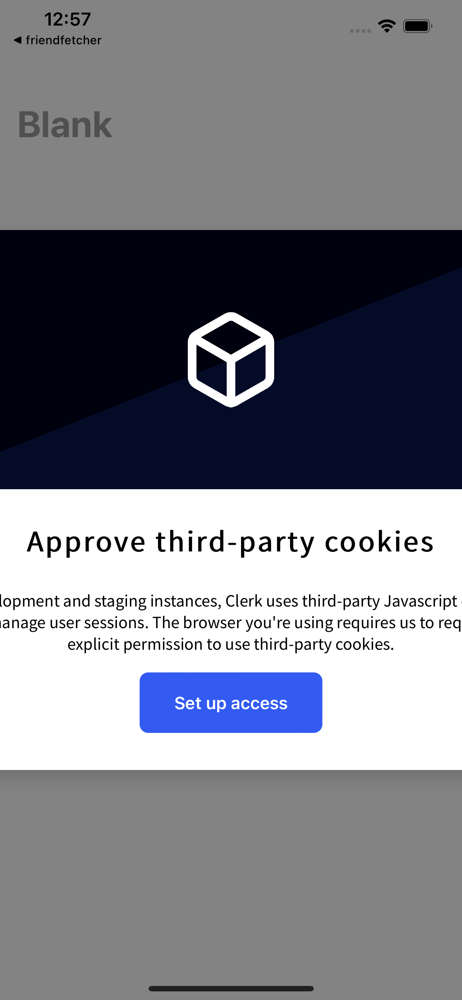

# Clerk Ionic Third Party Cookies Example

Clerk is bringing up the third party cookies notification when running on IOS. This project uses `@clerk/clerk-expo` with a custom token cache.

## Getting Started

1. Install dependencies: `npm install`
2. Launch the emulator: `npm run start`
   - This will prompt you to select an IOS emulator to run the application on.
3. The following is what you will see when the app launches.

